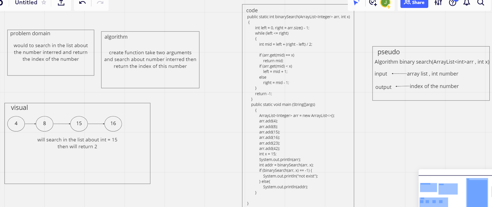

# Binary Search of Sorted Array
<!-- Description of the challenge -->
in this challenge created method to search about number in the arraylist and return the index of the number

## Whiteboard Process
<!-- Embedded whiteboard image -->

## Approach & Efficiency
<!-- What approach did you take? Discuss Why. What is the Big O space/time for this approach? -->
it took the array and divided it and still search to find the number to return the index