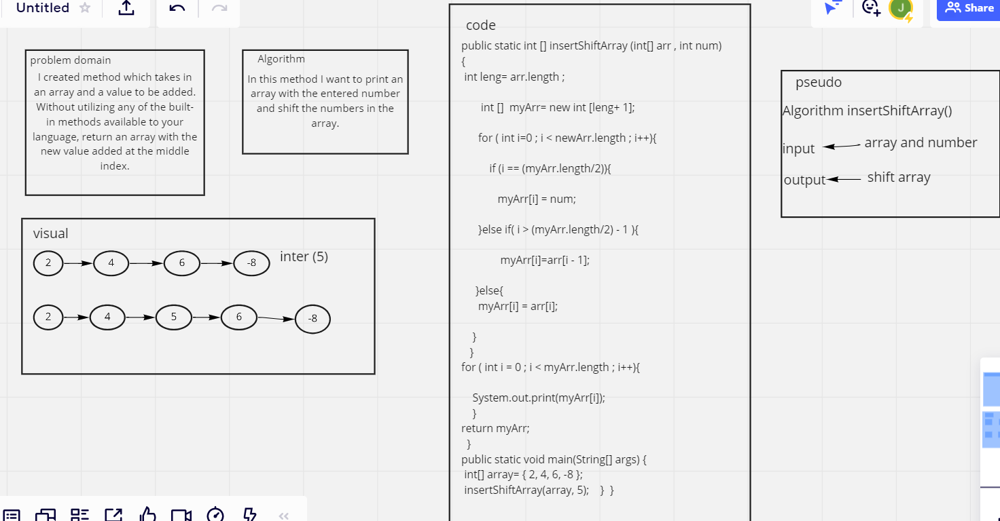

# Insert to Middle of an Array
<!-- Description of the challenge -->
I created method which takes in an array and a value to be added and return an array with the new value added at the middle index.

## Whiteboard Process
<!-- Embedded whiteboard image -->

## Approach & Efficiency
<!-- What approach did you take? Discuss Why. What is the Big O space/time for this approach? -->
In this method I want to print an array with the entered number and shift the numbers in the array.