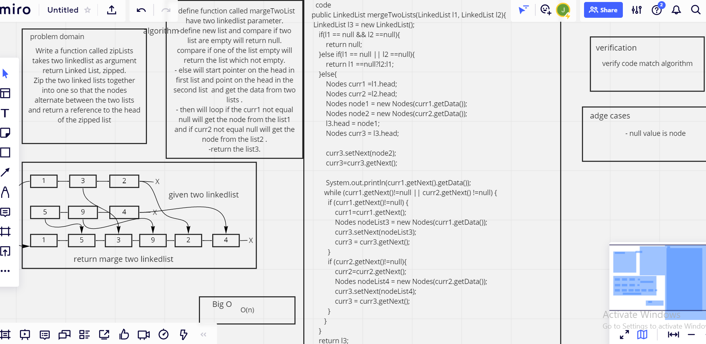

# Challenge Summary
<!-- Description of the challenge -->
Write a function called zipLists takes two linkedlist as argument
return Linked List, zipped.
Zip the two linked lists together into one so that the nodes alternate between the two lists and return a reference to the head of the zipped list

## Whiteboard Process
<!-- Embedded whiteboard image -->

## Solution
<!-- Show how to run your code, and examples of it in action -->

LinkedList linked =new LinkedList();
linked.append(60);
linked.append(70);
linked.append(80);
linked.append(90);
LinkedList linked2 =new LinkedList();
linked2.append(-60);
linked2.append(-70);
linked2.append(-80);
LinkedList linked3 =new LinkedList();
System.out.println(linked3.mergeTwoLists(linked,linked2));

result: {60} ->{-60} ->{70} ->{-70} ->{80} ->{-80} ->{90} ->Null

