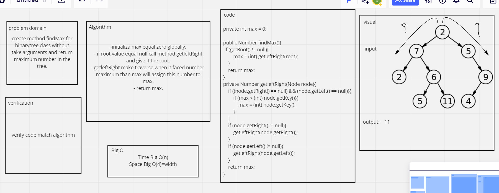

# Challenge Summary
<!-- Description of the challenge -->
create method findMax for binarytree class without take arguments and return maximum number in the tree.

## Whiteboard Process
<!-- Embedded whiteboard image -->

## Approach & Efficiency
<!-- What approach did you take? Why? What is the Big O space/time for this approach? -->
Time Big O(n)
Space Big O(4)=width

## Solution
<!-- Show how to run your code, and examples of it in action -->

BineryTree tree = new BineryTree();
tree.setRoot(new Node(2));
tree.getRoot().setLeft(new Node(7));
tree.getRoot().setRight(new Node(5));
tree.getRoot().getLeft().setRight(new Node(6));
tree.getRoot().getLeft().getRight().setLeft( new Node(1));
tree.getRoot().getLeft().getRight().setRight(new Node(11));
tree.getRoot().getRight().setRight(new Node(9));
tree.getRoot().getRight().getRight().setLeft(new Node(4));

System.out.println("Maximum element is "+ tree.findMax());

Solution: 11
